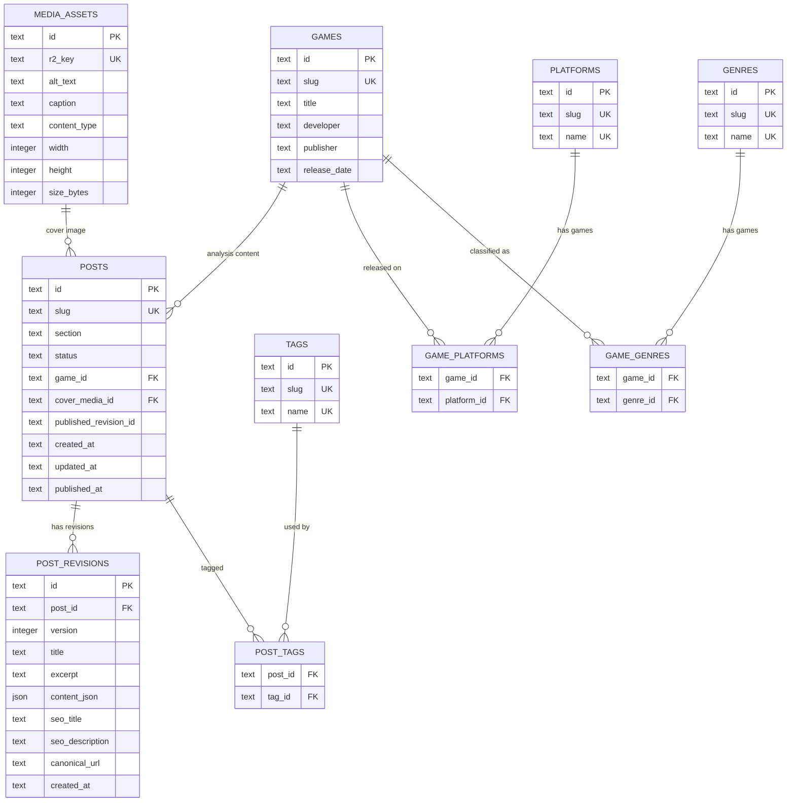

# Database schema

Cesco Blog stores editorial content in Cloudflare D1 using Drizzle-managed SQLite
migrations. The first schema supports drafts, published revisions, SEO metadata,
game metadata for analysis posts, tags, and R2-backed media references.

## Entity relationship diagram



## Draft and publish model

| Concept   | Rule                                                                                                                                          |
| --------- | --------------------------------------------------------------------------------------------------------------------------------------------- |
| Draft     | A post can have many `post_revisions`; the latest draft is the highest version.                                                               |
| Publish   | `posts.published_revision_id` points to the revision currently public.                                                                        |
| Integrity | `published_revision_id` is indexed text to avoid a circular D1/Drizzle foreign key. Application code must ensure it belongs to the same post. |
| Enums     | `section` and `status` are typed in Drizzle; application code must validate allowed values before writes.                                     |
| Rich text | `post_revisions.content_json` stores structured editor JSON, not HTML.                                                                        |
| Analysis  | Analysis posts may reference one `games` row. Games never store numeric scores.                                                               |
| Media     | `media_assets.r2_key` stores the future R2 object key; uploads are not implemented in this slice.                                             |

## Local workflow

```sh
pnpm run db:generate
pnpm run db:migrate:local
pnpm run cf:types
pnpm run dev:cf
```

Remote migrations require replacing the placeholder D1 database ID in
`wrangler.jsonc` with the real Cloudflare database ID. Remote deploys also need
real Cloudflare resource IDs for any explicitly configured bindings.
