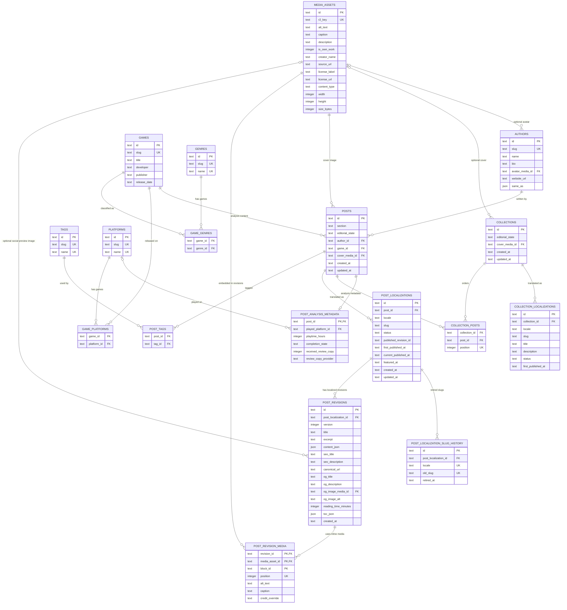

# Database schema

Cesco Blog stores editorial content in Cloudflare D1 using Drizzle-managed SQLite
migrations. The schema supports locale-neutral editorial posts, per-locale
drafts and published revisions, localized SEO metadata, localized Open
Graph/social preview metadata, game metadata for analysis posts, tags, and
R2-backed media references.

It also models authorship, editorial series, manual featuring, retired-slug
history for redirects, analysis-specific editorial metadata, and derived render
values computed once per revision.

## Entity relationship diagram



## Draft and publish model

| Concept              | Rule                                                                                                                                                                                                                                                                                                                                                                                                                                                                 |
| -------------------- | -------------------------------------------------------------------------------------------------------------------------------------------------------------------------------------------------------------------------------------------------------------------------------------------------------------------------------------------------------------------------------------------------------------------------------------------------------------------- |
| Post aggregate       | `posts` is locale-neutral and stores shared editorial state, section, game metadata link, and cover media. `posts.editorial_state` is the aggregate-level hide/archive switch across all localizations.                                                                                                                                                                                                                                                              |
| Localization         | `post_localizations` stores one row per `(post_id, locale)` with localized slug, lifecycle status, published pointer, and publication timestamps. Supported locales are `es` and `en`.                                                                                                                                                                                                                                                                               |
| Draft                | A localization can have many `post_revisions`; the latest draft for a language is the highest version for that localization.                                                                                                                                                                                                                                                                                                                                         |
| Publish              | `post_localizations.published_revision_id` points to the revision currently public for that language, so Spanish and English can publish independently.                                                                                                                                                                                                                                                                                                              |
| Publish timestamps   | `first_published_at` is set on the first publication and never cleared or overwritten. `current_published_at` tracks the latest publication event for editorial bookkeeping only. Neither is cleared on unpublish. See ADR-0010.                                                                                                                                                                                                                                     |
| Public ordering      | Listings and RSS order by `first_published_at DESC`, so republishing does not move a post back to the top. See ADR-0014.                                                                                                                                                                                                                                                                                                                                             |
| URL lifecycle        | A localization that was never published answers `404`; one that was published and later withdrawn answers `410`. `first_published_at` being non-null is the sole determinant. `posts.editorial_state = 'archived'` blocks serving but never chooses the status code. See ADR-0010.                                                                                                                                                                                   |
| Slug history         | `post_localization_slug_history` maps retired slugs to their localization for `301` redirects, unique on `(locale, old_slug)`. Retired slugs are reserved permanently; renaming again rewrites existing rows so every retired slug resolves in one hop. Reuse prevention is enforced in application code, not by a constraint.                                                                                                                                       |
| Authorship           | `posts.author_id` references `authors`, which supplies the visible byline and the `author` field of the `BlogPosting` structured data. A single foreign key is used instead of a join table until a second author exists.                                                                                                                                                                                                                                            |
| Featured             | `post_localizations.featured_at` marks manually featured content per language. Featured queries still require the post to be publicly servable.                                                                                                                                                                                                                                                                                                                      |
| Derived render data  | `post_revisions.reading_time_minutes` and `toc_json` are computed from `content_json` at publish time. Persisting them is safe because revisions are immutable. TOC anchors derive from `content_json` block IDs, never from heading text. See ADR-0012.                                                                                                                                                                                                             |
| Collections          | `collections` is a locale-neutral series aggregate with `collection_localizations` for per-language slug, title, and status, and `collection_posts` for explicit ordering. A series may mix `analysis` and `opinion` posts. `collection_localizations.first_published_at` follows the same contract as the post column, so the ADR-0010 URL lifecycle applies to series URLs. Collection slugs have no history table and are treated as immutable after publication. |
| Analysis metadata    | `post_analysis_metadata` holds locale-neutral analysis data: platform played (referencing `platforms`), playtime, completion state, and review-copy disclosure. The visible disclosure sentence is localized from UI strings, not stored here.                                                                                                                                                                                                                       |
| Integrity            | `published_revision_id` is indexed text to avoid a circular D1/Drizzle foreign key. Application code must ensure it belongs to the same localization.                                                                                                                                                                                                                                                                                                                |
| Slugs                | `(locale, slug)` is unique so `/es/...` and `/en/...` can use language-specific slugs without colliding across languages.                                                                                                                                                                                                                                                                                                                                            |
| Enums                | `section`, post aggregate `editorial_state`, localization `status`, and `locale` are typed in Drizzle; application code must validate allowed values before writes. Current section values are `analysis` and `opinion`; post editorial states are `active` and `archived`.                                                                                                                                                                                          |
| Rich text            | `post_revisions.content_json` stores structured editor JSON, not HTML, scoped to a localization.                                                                                                                                                                                                                                                                                                                                                                     |
| Localized SEO/OG     | `post_revisions` stores title, excerpt, canonical URL, SEO fields, and Open Graph/social fields per localization revision.                                                                                                                                                                                                                                                                                                                                           |
| Analysis             | Analysis posts may reference one `games` row. Games never store numeric scores.                                                                                                                                                                                                                                                                                                                                                                                      |
| Media                | `media_assets.r2_key` stores the future R2 object key; uploads are not implemented in this slice. `alt_text` remains the canonical accessibility and SEO alt text for the asset.                                                                                                                                                                                                                                                                                     |
| Attribution          | `media_assets` stores reusable attribution fields: description, own-work flag, creator, source URL, license label, and license URL. Inline placements may override displayed credit with `post_revision_media.credit_override`.                                                                                                                                                                                                                                      |
| Inline media         | `post_revision_media` maps editor block IDs to media assets per revision. It cascades with the revision and asset, stores per-placement alt text/caption overrides, uses `(revision_id, block_id, media_asset_id)` as its primary key, and keeps `(revision_id, block_id, position)` unique.                                                                                                                                                                         |
| Social preview image | `post_revisions.og_image_media_id` references `media_assets` and is set to null if the asset is removed.                                                                                                                                                                                                                                                                                                                                                             |
| Public visibility    | Public post queries must require `posts.editorial_state = 'active'` and `post_localizations.status = 'published'`. The post aggregate can hide all localized versions while each localization keeps its own publication lifecycle.                                                                                                                                                                                                                                   |

## Local workflow

```sh
pnpm run db:generate
pnpm run db:migrate:local
pnpm run cf:types
pnpm run dev:cf
```

Remote migrations require replacing the placeholder D1 database ID in
`wrangler.jsonc` with the real Cloudflare database ID. Remote deploys also need
real Cloudflare resource IDs for any explicitly configured bindings.
